# Week 21 Homework Assignment Advanced Solidty & Smart Contracts
Sydney University - Fintech Bootcamp - Week 21 Homework 

Due 31 August 2021

By Grace Ho

&nbsp;

## Background
This week, we were required to deploy a Crowdsale contract for PupperCoin, which included sale goal & maximum cap, as well as time limit functionality.

Two Solidity files have been created, named:
 - Wk21_HW_PupperCoin.sol, and
 - Wk21_HW_Crowdsale.sol.
 
 The Wk21_HW_Crowdsale.sol file inherits from the Wk21_HW_PupperCoin.sol, and also inherits functionality from the following OpenZeppelin contracts:
 - Crowdsale,
 - MintedCrowdsale,
 - CappedCrowdsale,
 - TimedCrowdsale,
 - RefundablePostDeliveryCrowdsale.

&nbsp;

## Dependencies

The deployment below assumes use of:
- Remix via browser, 
- Metamask connected to Rinkeby Testnet, with testnet funds (from Rinkeby faucets).

&nbsp;

## Deployment

The contracts have been deployed on the Rinkeby ethereum Testnet.  
- The Token sale address is: 0x821001Ed0FC93d693606d61FEBBA431D7ced3093
- The Token address is: 0x0357231c0AB7249E5AB3268Ef5eB115a5A1C25a4

In Remix, load both the solidity files named Wk21_HW_PupperCoin.sol and Wk21_HW_Crowdsale.sol.

To deploy the contracts, connect Remix to Injected Web3 environment, and connect Metamask to Rinkeby Testnet.  Check that there are funded accounts linked between Remix and Metamask.

&nbsp;

### Step 1 - Launch deployer contract:

Open the Wk21_HW_Crowdsale.sol file. 

From the Contract dropdown, select 'PupperCoinSaleDeployer'.

Input the coin name (here PupperCoin, the coin symbol (here PUP), and the deploying wallet address.

Click 'Deploy' (or 'Transact').  Metamask will request confirmation for gas fees.

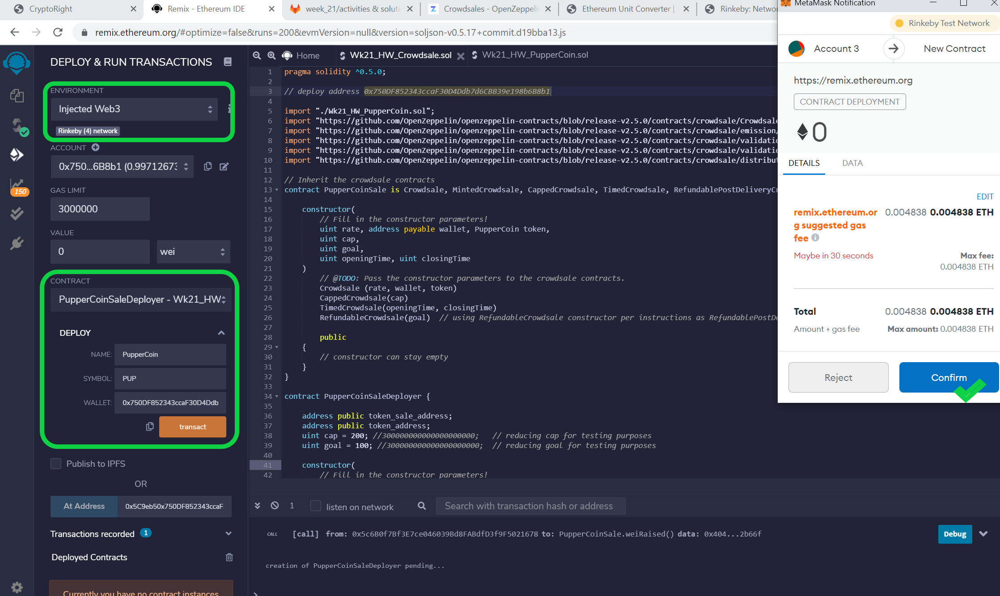

&nbsp;

Under Deployed Contracts, a new dropdown called 'PupperCoinSaleDeployer' will be created.  Click on this dropdown, and it will show two blue buttons for 'token_address', and 'token_sale_address'.  Click the two blue buttons to expose the addresses.

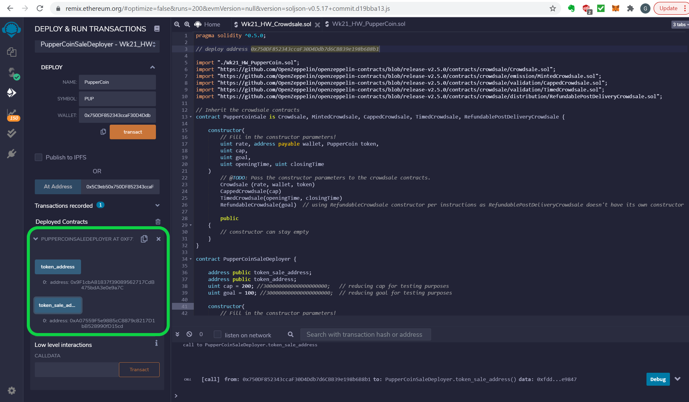

&nbsp;

### Step 2 - Launch Sale contract:

Under Contract, select PupperCoinSale.

Copy the address from 'token_sale_address', and paste it in the the 'At Address' input field.  

Click 'At Address'.

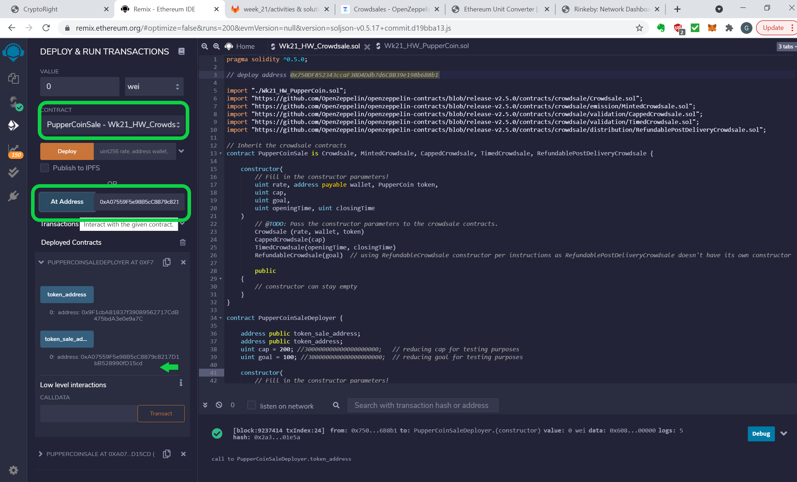

&nbsp;

Under 'Deployed Contract', a new dropwdown called 'PupperCoinSale' will be created. 

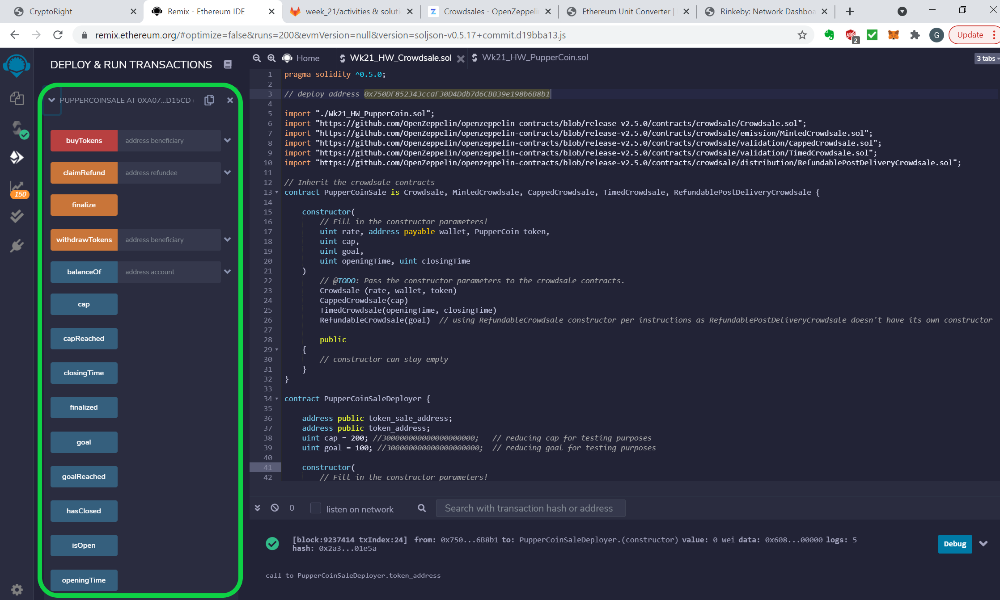

&nbsp;

### Step 3 - Launch Coin contract:

Under Contract, select PupperCoin.

Copy the address from 'token_address', and paste it in the the 'At Address' input field.  

Click 'At Address'.

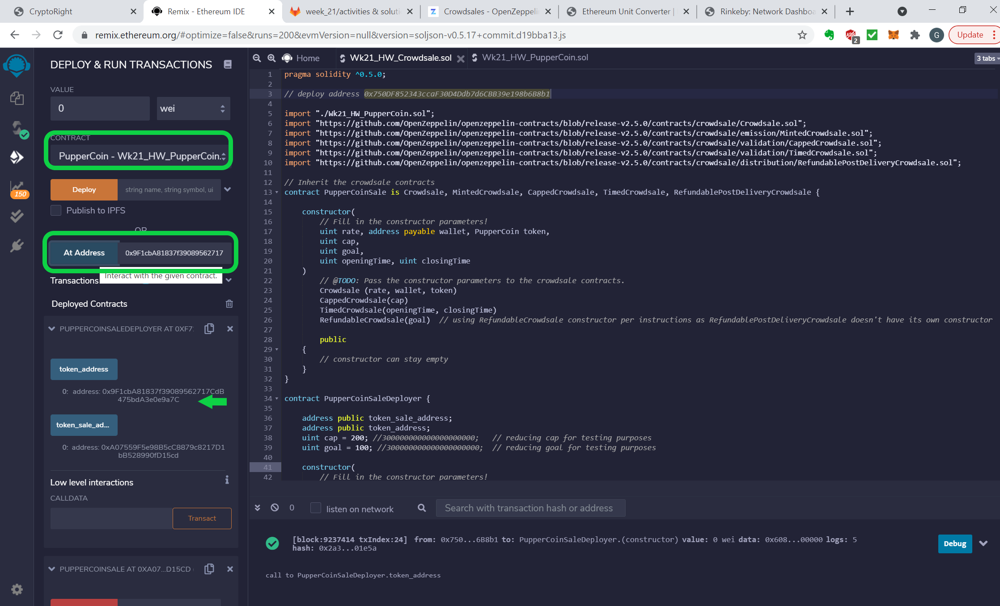

&nbsp;

Under 'Deployed Contract', a new dropwdown called 'PupperCoin' will be created. 

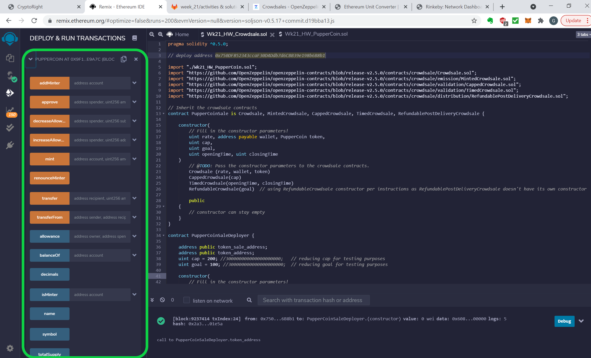

&nbsp;

### Step 4 - functionality: 

4a) Note for the purpose of the test, the contract closing time has been amended to now + 10 minutes.  Also the goal has been decreased to 100 wei, and cap to 300 wei (due to limited testnet funds).

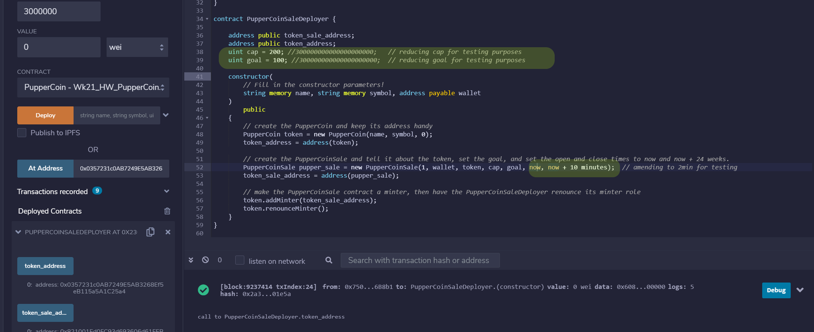

&nbsp;

4b) To purchase PUP coins
- Under Deployed Contract > PupperCoinSale, paste in the purchasing address in the 'buyTokens' box.  
- Paste the same address in the balanceOf box and clicking it will confirm there is 0 starting balance.
- Input eg 100 wei into the Value input box, and click the 'buyTokens' button.

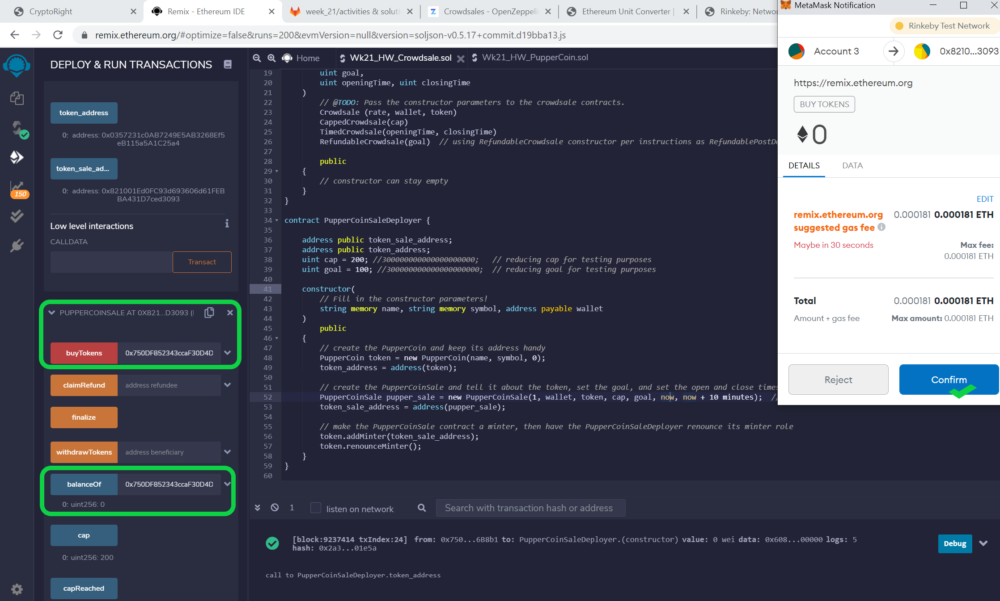

&nbsp;

- Reclicking the balanceOf box should show the balance has increased to 100.
- This can be repeated from the same or different wallet address until the goal and cap are reached (both found in the PupperCoinSale deployed contract). 

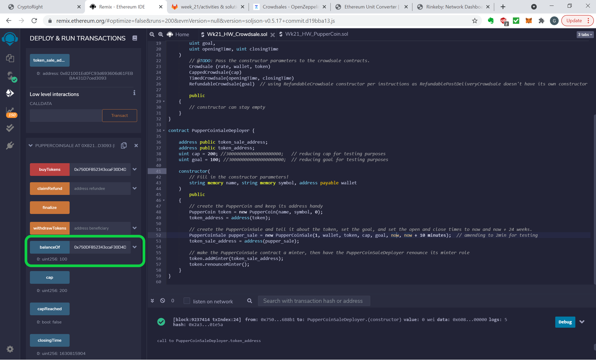

&nbsp;

4c) To finalise the sale
- Check Deployed Contracts > PupperCoinSale for whether the goal, cap, and hasClosed (sale closing time) has been reached.

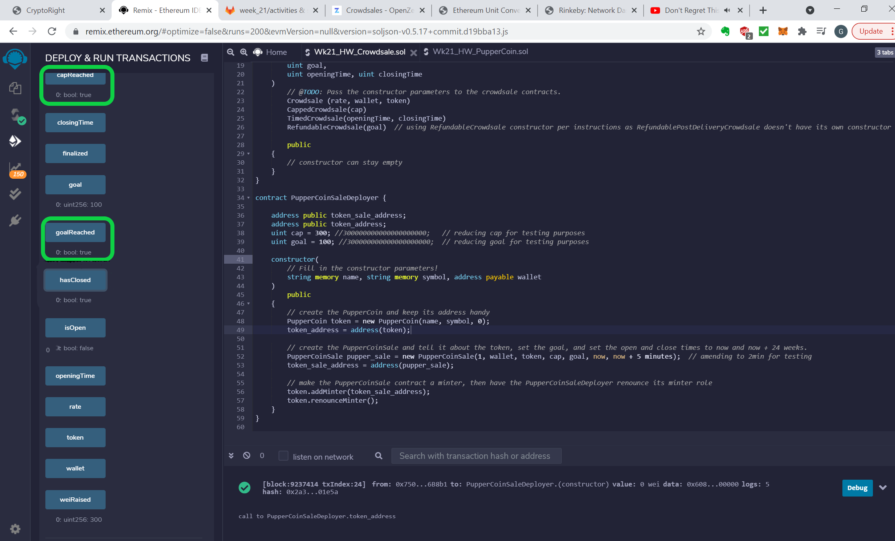

&nbsp;

- Once the closing time limit has been reached, we can finalise the contract. The 'hasClosed' and 'finalised' buttons should show false, until we finalise the sale.

- click on the 'Finalise' button to finalise the sale.  The 'finalised' box will change from false to true.

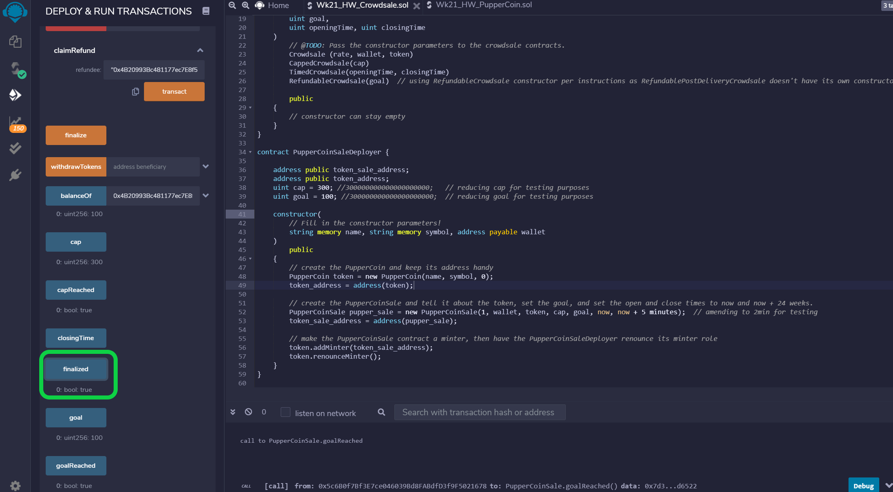

&nbsp;

-- END --

